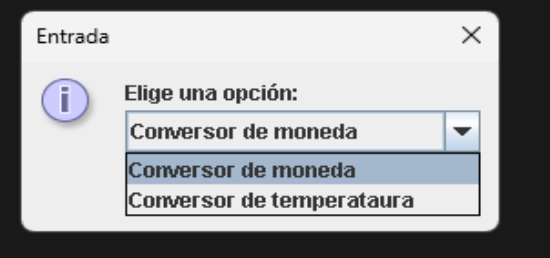
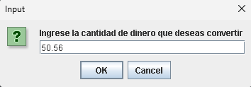
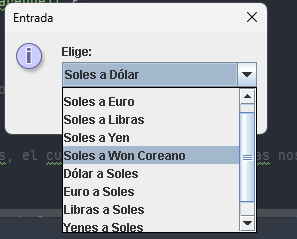
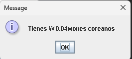
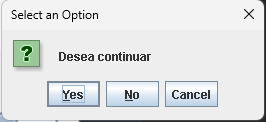
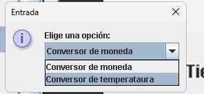
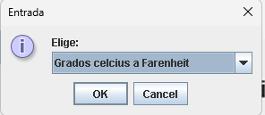
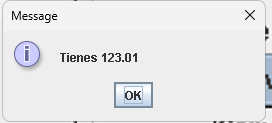

# Aplicación de Conversión: Challangue

## Descripción

Challangue es una aplicación de escritorio que te permite convertir entre diferentes tipos de monedas y temperaturas. Proporciona una interfaz simple y fácil de usar para realizar conversiones rápidas y precisas.

## Características

- Conversión de moneda: Soles a Dólar, Euro, Libras, Yen, Won Coreano y viceversa.
- Conversión de temperatura: Celsius a Fahrenheit, Kelvin y viceversa.

## Requisitos

- Java 8 o superior
- Conexión a internet para la conversión de moneda (utiliza una API externa)

## Instrucciones de Uso

1. Ejecuta la aplicación.
2. Selecciona el tipo de conversión que deseas realizar: moneda o temperatura.
3. Ingresa el valor que deseas convertir.
4. Selecciona la unidad de conversión.
5. La aplicación mostrará el resultado de la conversión.

¡Es así de simple! ¡Disfruta convirtiendo con Challangue!

## Capturas de Pantalla

## Créditos

- Desarrollado por [Tu Nombre]

## Licencia

Este proyecto está bajo la Licencia [tipo de licencia]. Consulta el archivo `LICENSE` para más detalles.

--- 

Puedes llenar los espacios "ruta/a/la/imagen.jpg", "ruta/a/la/captura1.jpg", "ruta/a/la/captura2.jpg", "Tu Nombre" y "tipo de licencia" según corresponda. ¿Necesitas ayuda con algo más?
